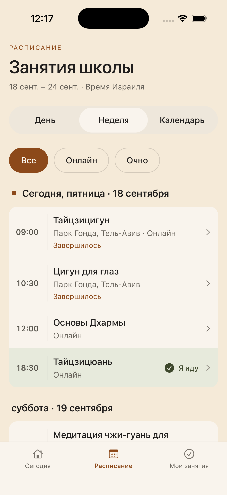

# Тихая практика

iOS-приложение школы: расписание → выбор занятий на конкретные даты → напоминания.
Текущий TestFlight: **1.0.0 (5)**, внутренняя группа тестирования.

## Документация

- [Продукт и текущие границы](docs/PRODUCT.md)
- [План развития](docs/ROADMAP.md)
- [Принятый дизайн и референсы](docs/DESIGN.md)
- [Журнал версий TestFlight](docs/TESTFLIGHT_CHANGELOG.md)
- [Проверки сборки 3](docs/schedule-build3.md)
- [UX-изменения и проверки сборки 4](docs/ux-feedback-build4.md)
- [Согласованный вариант 1 и проверки сборки 5](docs/ux-feedback-build5.md)
- [Архитектура библиотеки — последующие этапы](docs/app-first-architecture.md)
- [Безопасность и состав репозитория](SECURITY.md)



## Запуск приложения

```sh
cd apps/practice-app
npm ci
npm run web
# macOS + Xcode, создаёт локальный native-проект:
npm run ios
```

Для TestFlight нужны личная Apple Developer team, локальная подпись и профиль.
Ключей и профилей в репозитории нет. `app.json` — источник номера сборки;
после генерации native-проекта сверяйте Info.plist и итоговый архив.
`export-options.plist` допускает внутреннее и внешнее тестирование; внешний
доступ требует Beta App Review. Загрузка не запускается автоматически.
Процедура выпуска описана в журнале версий.

## Публичный сервис расписания (не закрытая библиотека)

```sh
python3.12 -m venv .venv
.venv/bin/pip install -r scripts/schedule-requirements.txt
.venv/bin/uvicorn practice_api.schedule_app:app --host 127.0.0.1 --port 8765
```

iOS также умеет читать публичное расписание школы напрямую. Веб использует API.
`EXPO_PUBLIC_SCHEDULE_API_URL` задаёт HTTPS-адрес сервиса. Пример переменных:
`apps/practice-app/.env.example`. `EXPO_PUBLIC_API_URL` — отдельный адрес закрытой
библиотеки, не сервиса расписания.

## Проверки

```sh
cd apps/practice-app
npx tsc --noEmit
npm run lint
node --test scripts/schedule-*.test.mjs
```

Из корня, с Python-окружением и зависимостями pytest/httpx2:

```sh
pytest tests/test_schedule*.py tests/test_reminder*.py tests/test_apns.py -q
```

Нативные проверки: сохранение выбора после перезапуска, системное разрешение,
доставка при закрытом приложении, отмена, отсутствие сети и смена часового пояса.

## Ограничения текущей версии

Регулярное расписание сайта на 14 дней. Telegram-отмены и фоновые изменения
расписания ещё не подключены. Карта практики, вики и плеер в `/prototype` —
демонстрационные экраны. Подтверждение доставки на пользовательском физическом
iPhone после обновления ещё ожидается.

## Происхождение снимка

Репозиторий создан из текущих исходников приложения и API после выпуска build 3.
Старая история Git, ingestion-инструменты и закрытый корпус practice_bot не
переносились. Исходники library API сохранены для следующих этапов; их данные
должны подключаться отдельно и не доступны в этом репозитории.
Тег `testflight/ios-1.0.0-3` обозначает импортированный снимок исходников, а не
ретроспективную Git-привязку первоначального Xcode-архива.
