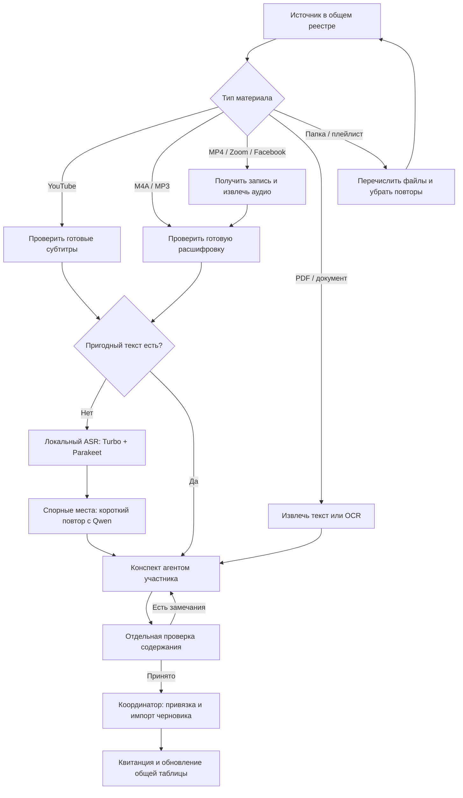
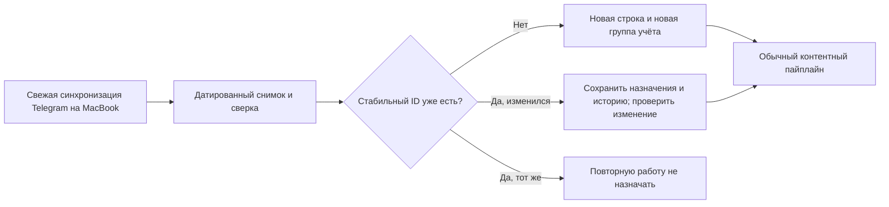

# Вики: работа группы и общий реестр

## Короткое описание для участников

Мы превращаем записи и документы школы в короткие конспекты с проверяемыми ссылками на источник. Сначала используем готовые субтитры или текст; если их нет, распознаём аудио на Mac mini с помощью Whisper Turbo и Parakeet, а спорные места уточняем Qwen. Агент участника готовит конспект, другой участник или его агент проверяет содержание, после чего координатор загружает результат в вики как черновик. Общая таблица хранит назначения, готовность, оставшуюся работу и оценки времени.

## Основная таблица

Файл: [wiki-materials.xlsx](../data/wiki-workspace/outputs/2026-10-02/wiki-materials.xlsx).
Это **рабочий реестр**, а Markdown-отчёты — его пояснения и история проверок.
Содержит приватные названия и ссылки: передавать только участникам группы,
которым владелец разрешил работу с корпусом. Паролей и Telegram-сессий в нём нет;
Zoom-ссылки с потенциальными секретами не включены, связь остаётся через каталог.

Листы:

- **Сводка**: живые формулы по типам, импортированным материалам и оставшейся работе.
  Ниже редактируемые нормативы ASR, редактуры и отдельной проверки.
- **Материалы**: одна строка на уникальный источник, название, дата публикации,
  доступ, текст, необходимость ASR, duration, статус, назначение, следующий шаг,
  партия, факт импорта и оценки времени. 45 выполненных стоят первыми.
- **Карточки**: связи исходных карточек с источниками. Один источник может
  встречаться в нескольких карточках; одна карточка может содержать несколько ссылок.

На старте 1171 источник: 692 YouTube, 244 Drive-аудио, 14 MP4, 7 PDF,
123 Zoom URL записи, 41 Facebook URL, 27 неизвестных Drive ID, 17 других ссылок
и 6 контейнеров (4 папки, 2 плейлиста). Контейнер — не отдельный урок.
Одинаковые ID/URL сведены; совпадение содержимого разных файлов ещё не проверено.
1126 строк не импортированы; это **не** 1126 доступных уникальных занятий.

## Точка отсчёта

Основной снимок содержит 1145 карточек, опубликованных **15.06.2025–18.09.2026**,
и сохранён 19.09.2026. Даты — публикации сообщений, не обязательно даты занятий.
Это охват имеющегося снимка, а не заявление о полной истории всех чатов школы.

21 дополнительный файл найден в папках при проверке 02.10.2026. Он отмечен
отдельной группой; дату его публикации не выдумывали. Аудит Drive от 02.10
уточняет MIME/размеры уже имеющихся ссылок, не является Telegram-синхронизацией.

Основной источник: `data/nikita-archive/2026-09-19/index.json`.
Дополнения: `data/wiki-audit/2026-10-02/drive-metadata.json`.
Факт выполненных работ: три подтверждённые импортированные партии
30.09, 01.10 и 02.10: 45 черновиков, 135 цитат. Отдельная независимая проверка
всех этих 45 не подтверждена и остаётся задачей.

## Схема обработки

Готовые субтитры используются первыми, но их наличие и пригодность проверяются
для каждой записи. Для PDF ASR не нужен; для аудио не нужно сначала создавать видео.
Недоступный источник получает задачу проверки доступа, а не выдуманный конспект.
Распознавание не считается истинным эталоном или одобрением преподавателя.

Аудио-процесс уже работает на Mac mini. Импорт сейчас связывает конспекты по
YouTube ID: для Drive/Zoom/Facebook ещё нужен адаптер стабильных идентификаторов.
PDF и содержимое контейнеров также требуют согласованной привязки к карточкам.
Эти этапы не объявлены готовыми; в реестре они записаны как следующий шаг/ограничение.

## Как участники редактируют таблицу

1. Координатор ведёт одну авторитетную копию. Можно импортировать XLSX в закрытую
   Google Sheets и назначить её новой основной копией; тогда сохранить её URL здесь.
   Пока такой облачный перенос и выдача доступа не выполнялись. Не вести несколько
   независимых Excel-копий как равноправные реестры.
2. Назначать по 3 источника: заполнить ответственного, проверяющего и уникальную
   партию, статус «Назначен». Проверить прежние назначения по ID источника.
3. Заполнить наличие текста и **«Нужен ASR»: Да / Нет / Уточнить**. Для ещё
   не проверенного готового текста оставлено «Уточнить», включая Drive-аудио.
   Это честная неопределённость, а не подтверждённая необходимость ASR.
4. Записать фактическую длительность в минутах. Не оценивать её по размеру файла.
   ASR без длительности или решения да/нет отображается как «нет данных».
   Нулевое время ASR означает, что этот этап не нужен или уже выполнен.
5. После редактуры — «Отредактирован», после отдельной проверки — pass и
   «Проверен». Если есть замечания — needs_changes; блокировка — blocked и причина.
   «Импортирован черновик» выставлять только по квитанции сервера, вместе с датой,
   ID партии и числом цитат. Импорт сам по себе не заменяет независимую проверку.
6. Факт работы заполнять отдельно от прогнозов. Неизвестный факт оставлять пустым.
   Нормативы относятся к агент-минутам; ожидание загрузки, слушание человеком,
   проверка доступа и разработка адаптеров сверх них. PDF/контейнеры требуют
   своей оценки и не включены в аудио-нормативы.

Жёлтые поля — рабочие вводы; R:W — формулы. A:E сохраняют идентичность и исходный
период. Названия в Drive взяты из метаданных; названия карточек сохранены на
листе «Карточки». Для строки с несколькими карточками координатор сначала
проверяет однозначность импорта. Два источника одной карточки нельзя независимо
публиковать в одинаковой revision.

## Инструкция агенту другой команды

Открой общий реестр и [protocol v1](wiki-contributor-pipeline.md). Работай только
с назначенными ID. Получи от координатора пакет исходных текстов, сегментов,
таймкодов и запрещённых спорных клипов; никакие admin-ключи не нужны.
Прочитай полный материал и подготовь 2–4 предложения и три точные цитаты.
Другой агент проверяет каждое утверждение, затем координатор выполняет сборку,
валидацию и импорт. Возвращай результат вместе с ID партии, ограничениями
и временем; не исправляй чужие исходные строки и не меняй статусы по догадке.

Команды в protocol v1 проверены для нынешнего Mac mini, не для произвольной
Windows/Linux машины. Новые типы источников сначала проходят маленькую
проверочную партию. Техническая проверка цитат не заменяет смысловую редактуру.

## Новые материалы и исправления старых

Дата 18.09.2026 — граница основного снимка. Последующие находки добавлять
отдельными группами с датой синхронизации; исходный знаменатель не переписывать.
Синхронизация проверяет не только новые сообщения, но и правки прежних:
одного фильтра «после даты» недостаточно. Смена ссылки/хеша требует проверки,
а недоступность не доказывает удаление. Новый текст опубликованного конспекта
получает новую revision и batch_id; история прежних публикаций сохраняется.

При добавлении строки расширить Excel Table, формулы R:W и валидации; проверить
изменение сводки. Текущие агрегаты охватывают строки 6–5000: выше этого лимита
агент расширяет диапазоны. Не пересобирать файл из исходного каталога поверх
введённых назначений: обновление объединяет строки по ID и сохраняет вводы.
Автоматический updater реестра пока не реализован; это правило ручного/агентного
обновления. Периодический Telegram-updater — отдельная задача, ещё не запущен.

## Проверка созданной таблицы

Сверены 45 импортов, 1171 уникальный ID и связь со всеми 1145 карточками.
Проверены изменение duration, переход ASR да → нет и явный неизвестный результат;
формульных ошибок не найдено. Листы просмотрены через рендер; формат дат
проверен в XLSX как числовые даты с date number format. Рендер библиотеки
показывает serial вместо форматированной даты; это ограничение превью.
Проверки в нативном Excel/Google Sheets ещё не было.
